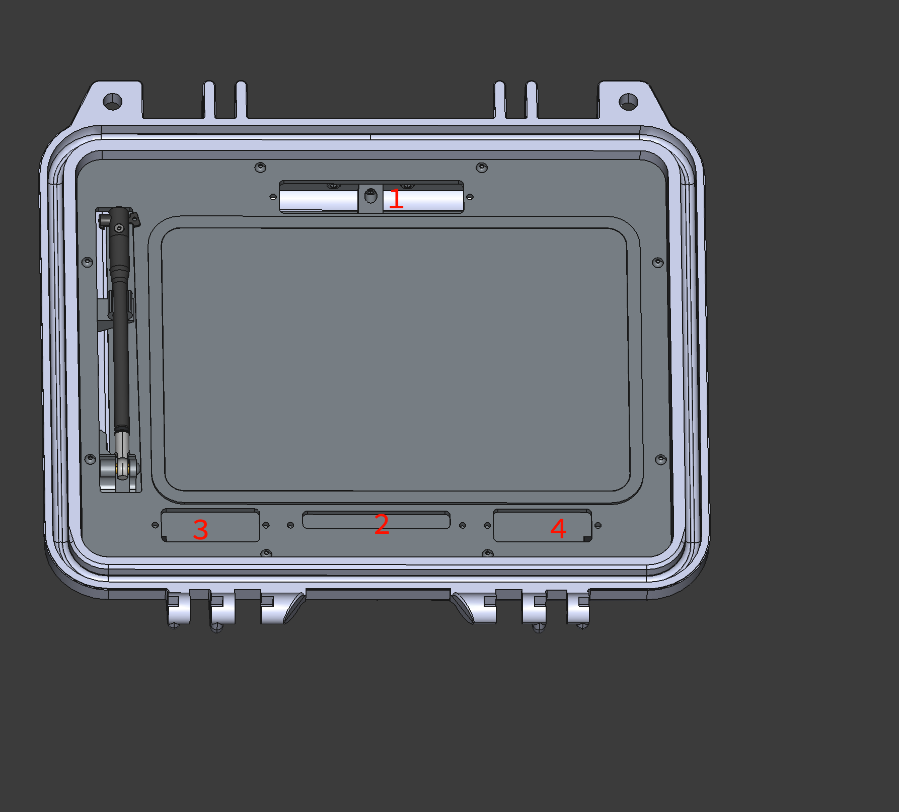

# Screen Panel

This directory contains the **Cyberdeck Screen Panel (Main)** 3D STEP files and related production resources.

---

## Status

**April 27, 2026**
Design and prototyping in progress.

---

## Directory Structure

```
./production/
├── parts/                 # STEP files for CNC machining and full models
├── mesh-3d-printing/      # STL files for components intended for 3D printing
```

* `./production/parts/`
  Contains STEP files for CNC fabrication and complete mechanical models.

* `./production/mesh-3d-printing/`
  Contains STL meshes for parts that should be 3D printed.

---

## Main Assembly File

* `./pannel.step.xz`

This is the **full screen panel assembly** in STEP format, compressed using `xz` due to file size limitations.

### Usage

```bash
xz -dk panel.step.xz
```

After decompression, import the `.step` file into your preferred CAD software.

---

## Design Notes



The main plate (aluminum sheet metal) includes several reserved cut areas for future expansion:

### Area 1 — Camera Module (Future)

Reserved cutout for a potential Raspberry Pi camera integration.

### Area 2 — Antenna & Signal Routing

Reserved space for:

* Antenna feed lines
* Flexible Printed Circuits (FPCs)
* Internal signal routing to the Cyberdeck bottom connector

**Note:**
Cables/FPCs are intended to be bundled and protected using TPU, forming a flat, reinforced structure similar to a *flat USB cable* (conceptually: `|:|`).

### Area 3 & 4 — Expansion Modules

Reserved cutouts for optional add-ons, such as:

* Small OLED/TFT displays
* Indicator LEDs
* Buttons or control interfaces

---

## Notes

* This design is modular and intended for iterative hardware expansion.
* Cut areas are intentionally reserved to support future features without redesigning the main plate.
* Mechanical and electrical integration (especially FPC routing) should be considered during assembly.


This project is under active development. Dimensions, cutouts, and interfaces may change between revisions.

---

Cyberdeck Project
Designed by Kali Assistant

Copyright (c) 2026 HyperPROBE Labs. All Rights Reserved.
