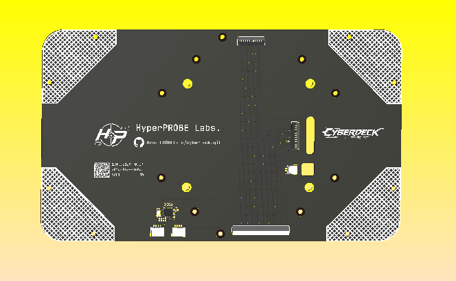

# Screen Panel PCB

This directory contains the PCB design and layout files for the Cyberdeck **screen panel module**.

---



## Status

**April 29, 2026**
Design and prototyping in progress.

---

## Directory Structure

```
./production/
├── GERBER-*.zip   # Manufacturing files for PCB fabrication
├── BOM-*.csv      # Bill of Materials
└── CPL-*.csv      # Component Placement List (Pick & Place)

./pcb-model.step.xz  # Compressed 3D STEP model of the PCB
```

---

## 3D Model Usage

Due to GitHub file size limits, the PCB 3D model is compressed using `xz`.

To extract:

```bash
xz -dk pcb-model.step.xz
```

You can then import the `.step` file into your CAD software.

---

## Design Overview

### 50-Pin FPC Integration

The PCB integrates both the camera interface and the Raspberry Pi Touch Display v2 through a **combined 50-pin FPC (Flexible Printed Cable)**.

* FPC design is currently in progress
* Intended to reduce cabling complexity between modules

---

### USB Hub Integration

The board includes a **USB2422 USB hub**, enabling expansion capabilities for the panel.

Two onboard USB expansion module slots are provided for future customization.

---

### Camera Module

Sourcing standalone CMOS sensors is difficult, so the current approach is:

* Use the **Raspberry Pi Camera Module v3 (NoIR)**
* Remove (de-solder) the CMOS module
* Integrate it into this custom PCB design

The camera base and mounting design are still under development.

---

### USB Expansion Modules

Two optional USB-connected addon module slots are included.

Potential use cases:

* Small OLED or TFT displays
* Status indicator LEDs
* Buttons or control interfaces

These modules connect to the onboard USB hub and communicate back to the Cyberdeck motherboard via the 50-pin FPC.

---

## Notes

* This is an actively evolving design
* Hardware, pinout, and module layout may change during prototyping
* Contributions and ideas for USB expansion modules are welcome

---

Cyberdeck Project
Designed by Kali Assistant

Copyright (c) 2026 HyperPROBE Labs. All Rights Reserved.
